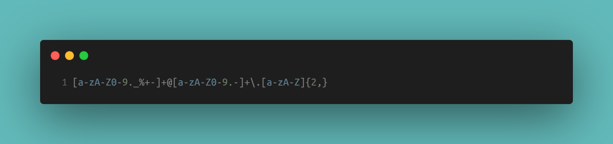

# Fun Regex Tutorial

This project is a tutorial explaining various regular expressions (regex) commonly used in web development. It aims to provide web developer learnings with a comprehensive understanding of regex patterns and their applications.

## Table of Contents

- [Introduction](#introduction)
- [Summary](#summary)
- [Anchors](#anchors)
- [Quantifiers](#quantifiers)
- [OR Operator](#or-operator)
- [Character Classes](#character-classes)
- [Flags](#flags)
- [Grouping and Capturing](#grouping-and-capturing)
- [Bracket Expressions](#bracket-expressions)
- [Greedy and Lazy Match](#greedy-and-lazy-match)
- [Boundaries](#boundaries)
- [Back-references](#back-references)
- [Author](#author)

## Introduction

A regular expression (regex) is a sequence of characters that defines a specific search pattern. In web development, regex is widely used for tasks such as validating user input, searching and replacing patterns within strings, and parsing data.

## Summary

Each section will include a detailed explanation of the regex component along with examples illustrating its usage.

## Anchors

Anchors are regex elements that assert a position in the string, rather than matching a character. They specify the beginning (^) or end ($) of a line or string, ensuring that a match occurs only at that specific position.

Example:

```regex
^Start
End$
```

## Quantifiers

Quantifiers specify the number of occurrences of the preceding element in a regex pattern. Common quantifiers include:

\*: Matches zero or more occurrences.
+: Matches one or more occurrences.
?: Matches zero or one occurrence.
{n}: Matches exactly n occurrences.
{n,}: Matches n or more occurrences.
{n,m}: Matches between n and m occurrences.

Example:

```regex
\d{3}-\d{2}-\d{4}
```

In the above example, \d{3} matches exactly three digits, followed by a hyphen, \d{2} matches exactly two digits, followed by another hyphen, and \d{4} matches exactly four digits.

## OR Operator

The OR operator in regex uses two methods: one using the pipe symbol (|) to denote alternatives, and another using the question mark (?) as a quantifier to match zero or one occurrence of a character.

Example using the pipe symbol:

```regex
cat|dog
```

## Character Classes

Character classes allow matching any character from a specified set. They are enclosed in square brackets [] and match a single character from the set.

[abc]: Matches a single character that is either 'a', 'b', or 'c'.
[0-9]: Matches any digit from 0 to 9.
[a-zA-Z]: Matches any uppercase or lowercase letter.

Example of an email validation using Character classes:

```
[a-zA-Z0-9._%+-]+@[a-zA-Z0-9.-]+\.[a-zA-Z]{2,}
```

[](../assets/quantifier-email-validation.png)

## Flags

Flags are optional parameters added to the end of a regex pattern to modify its behavior. Common types include:

- i: Case-insensitive matching.
- g: Global matching (find all matches rather than stopping after the first).
- m: Multiline mode (treats beginning (^) and end ($) characters as working across multiple lines).

### One such scenario is when performing case-insensitive searches.

Consider a feature where users can search for products by their names. In this case, you might want the search functionality to be case-insensitive so that users can find products regardless of whether they enter the name in uppercase, lowercase, or a combination of both.
Here's how you can use the i flag to perform a case-insensitive search in JavaScript:

```
const searchString = "iphone";
const productNames = ["iPhone 11", "Samsung Galaxy", "Google Pixel"];

const regex = new RegExp(searchString, "i");
const matchingProducts = productNames.filter(name => regex.test(name));

console.log(matchingProducts); // Output: ["iPhone 11"]
```

[](./assets/flags-search-case-sensitive.png)

## Grouping and Capturing

Regex capturing and grouping involve defining subpatterns within a larger pattern to extract specific parts of a matched string. Capturing groups are marked by parentheses () in a regular expression.

Capturing Groups: Enclosed within parentheses (), capturing groups capture and isolate specific parts of a matched string. These captured substrings can be referenced separately later on. For example, in the regex pattern /(\d{2})-(\d{2})-(\d{4})/, each set of parentheses captures the day, month, and year from a date string.

Grouping without Capturing: Non-capturing groups, denoted by (?:), function similarly to capturing groups in structuring subpatterns but do not store the matched substring. They are useful for organizing patterns without capturing specific parts.

Example:

```const text = "Date: 12-25-2022";

// Capturing groups
const regexWithCapture = /(\d{2})-(\d{2})-(\d{4})/;
const matchWithCapture = text.match(regexWithCapture);
console.log("Capturing groups:");
console.log("Day:", matchWithCapture[1]);
console.log("Month:", matchWithCapture[2]);
console.log("Year:", matchWithCapture[3]);

// Non-capturing groups
const regexWithoutCapture = /(?:\d{2}-){2}\d{4}/;
const matchWithoutCapture = text.match(regexWithoutCapture);
console.log("\nNon-capturing group match:", matchWithoutCapture[0]);

```

[](./assets/capturing-groups-and-non-groups-date.png)

## Bracket Expressions

Brackets indicate a set of characters to match. Any individual character between the brackets will match, and you can also use a hyphen to define a set. For example, [a-zA-Z0-9] matches any alphanumeric character.

```const text = "The quick brown fox jumps over the lazy dog.";

// Matches any vowel
const vowelRegex = /[aeiou]/gi;
console.log(text.match(vowelRegex));
// Output: ['e', 'u', 'i', 'o', 'o', 'u', 'e', 'o', 'e', 'a', 'o']

// Matches any lowercase letter
const lowercaseRegex = /[a-z]/g;
console.log(text.match(lowercaseRegex));
// Output: ['h', 'e', 'q', 'u', 'i', 'c', 'k', 'b', 'r', 'o', 'w', 'n', 'f', 'o', 'x', 'j', 'u', 'm', 'p', 's', 'o', 'v', 'e', 'r', 't', 'h', 'e', 'l', 'a', 'z', 'y', 'd', 'o', 'g']

// Matches any character that is not a vowel
const consonantRegex = /[^aeiou]/gi;
console.log(text.match(consonantRegex));
// Output: ['T', 'h', ' ', 'q', 'c', 'k', ' ', 'b', 'r', 'w', 'n', ' ', 'f', 'x', ' ', 'j', 'm', 'p', 's', ' ', 'v', 'r', ' ', 't', 'h', ' ', 'l', 'z', 'y', ' ', 'd', 'g', '.']
```

[](./assets/brackets-example-vowels.png)

## Greedy and Lazy Match

Greedy matching tries to match as much of the string as possible.
Lazy matching tries to match as little of the string as possible.
You can control the greediness of quantifiers in regex patterns by adding a ? after them to make them lazy.

Greedy Matching Example:

```
const homeAddress = "<address>123 Main Street<br>Cityville, State<br>Country</address>";
const regexGreedy = /<address>(.*)<\/address>/;
const matchGreedy = homeAddress.match(regexGreedy);
console.log(matchGreedy[1]);
// Output: "123 Main Street<br>Cityville, State<br>Country"
```

Lazy Matching Example:

```const homeAddress = "<address>123 Main Street<br>Cityville, State<br>Country</address>";
const regexLazy = /<address>(.*?)<\/address>/;
const matchLazy = homeAddress.match(regexLazy);
console.log(matchLazy[1]); // Output: "123 Main Street<br>"
```

[](./assets/greedy-lazy-matching.png)

## Boundaries

boundaries define specific positions in a string rather than the actual characters themselves. They are used to match patterns that occur at the beginning, end, or between characters in a string, without consuming any characters in the match.

There are several types of boundaries in regex:

Word Boundaries (\b): a position where a word character (a-z, A-Z, 0-9, or underscore) is not followed or preceded by another word character.
^ asserts the position at the beginning of a string.
$ asserts the position at the end of a string.

The examples above used boundaries to separate the

```
const homeAddress = "<address>123 Main Street<br>Cityville, State<br>Country</address>";
const regexGreedy = /<address>(.*)<\/address>/;
const matchGreedy = homeAddress.match(regexGreedy);
console.log(matchGreedy[1]);
// Output: "123 Main Street<br>Cityville, State<br>Country"
```

In the regular expression

```/<address>(.*?)</address>/

```

the boundaries are used to looking for text that appears between <address> and </address> tags in the homeAddress string.

## Back-references

n regex, a back-reference allows you to refer back to a captured group within the same regular expression pattern. When you capture a group using parentheses, you can reference that captured group later in the pattern using a back-reference.

In the example provided earlier where we matched the content within <address> tags using a lazy regex, we didn't utilize back-references. However, I can illustrate how back-references could be used in a different context:

If we want validate that the content within <address> tags begins and ends with the same word. We can achieve this using a regex pattern with a back-reference.

```const homeAddress = "<address>123 Main Street<br>Cityville, State<br>Country</address>";
const regexWithBackref = /<address>(\w+).*?\1<\/address>/;
const matchWithBackref = homeAddress.match(regexWithBackref);
console.log(matchWithBackref[0]); // Output: "<address>123 Main Street<br>Cityville, State<br>Country</address>"
```

- (\w+) captures a word (the first word) within the <address> tags.
- .\*? matches any characters (lazily) between the opening and closing <address> tags.
- \1 is a back-reference to the first captured group, ensuring that the content within the <address> tags ends with the same word as it started with.

## Author

This tutorial is authored by [Mel W]. You can find more about the author on [GitHub](https://github.com/Mwrightvet).
